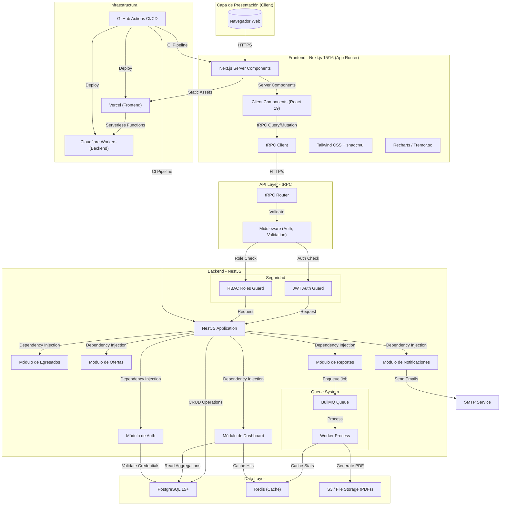
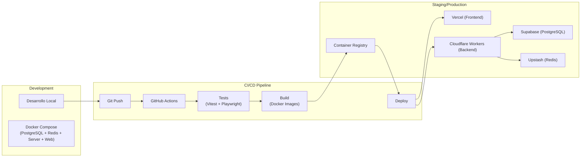
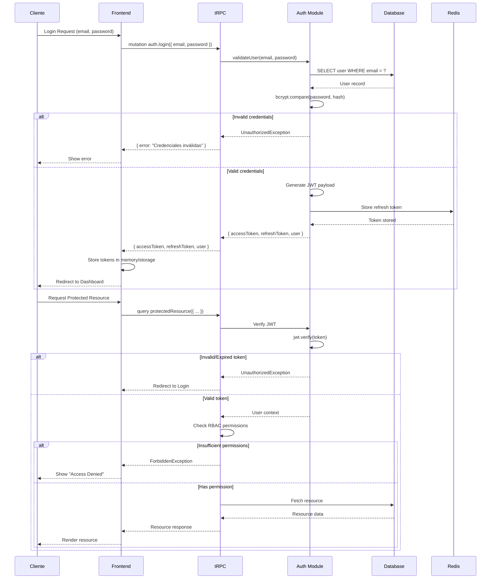

# Arquitectura del Sistema de Egresados y Oferta Laboral

## Diagrama de Arquitectura General

## Diagrama de Flujo de Datos

```mermaid
sequenceDiagram
    participant U as Usuario
    participant F as Frontend (Next.js)
    participant T as tRPC Router
    participant B as Backend (NestJS)
    participant Q as BullMQ Queue
    participant W as Worker
    participant D as PostgreSQL
    participant R as Redis
    participant S as Storage

    U->>F: Request (Login/Query/Mutation)
    F->>T: tRPC Call
    T->>B: Route to Module

    alt Authentication Flow
        B->>D: Validate User
        D-->>B: User Data
        B->>R: Create Session
        R-->>B: Session Token
        B-->>F: JWT Token
    end

    alt CRUD Operations
        B->>D: Execute Query
        D-->>B: Result
        B-->>F: Response
        F-->>U: Render UI
    end

    alt Report Generation (Async)
        F->>T: Request Report Generation
        T->>B: Enqueue Job
        B-->>F: Job ID
        F->>F: Poll Status
        Q->>W: Process Job
        W->>D: Fetch Data
        W->>W: Generate PDF
        W->>S: Store PDF
        S-->>W: PDF URL
        W-->>Q: Job Complete
        F->>T: Get Report URL
        T->>S: Get PDF URL
        S-->>T: PDF URL
        T-->>F: Download Link
        F-->>U: Download PDF
    end

    alt Dashboard Analytics
        F->>T: Fetch Dashboard Data
        T->>B: Query Stats
        B->>R: Check Cache
        alt Cache Hit
            R-->>B: Cached Data
        else Cache Miss
            B->>D: Aggregate Query
            D-->>B: Aggregated Data
            B->>R: Store in Cache
        end
        B-->>F: Dashboard Data
        F->>F: Render Charts
    end
```

## Diagrama de Arquitectura de Módulos NestJS

```mermaid
graph TB
    subgraph "NestJS Application"
        AppModule["AppModule"]
        ConfigModule["ConfigModule"]

        subgraph "Core Modules"
            AuthModule["AuthModule"]
            UsersModule["UsersModule"]
        end

        subgraph "Business Modules"
            EgresadosModule["EgresadosModule"]
            OfertasModule["OfertasModule"]
            PostulacionesModule["PostulacionesModule"]
            DashboardModule["DashboardModule"]
            ReportesModule["ReportesModule"]
            NotificacionesModule["NotificacionesModule"]
        end

        subgraph "Shared Services"
            DatabaseService["DatabaseService (Prisma)"]
            CacheService["CacheService (Redis)"]
            QueueService["QueueService (BullMQ)"]
            EmailService["EmailService"]
            StorageService["StorageService (S3)"]
            PdfService["PdfService (Puppeteer)"]
        end
    end

    subgraph "tRPC Integration"
        TRPCModule["TRPCModule"]
        TRPCRouters["TRPCRouters"]
        TRPCContext["TRPCContext"]
    end

    subgraph "Security Layer"
        JwtStrategy["JwtStrategy"]
        JwtAuthGuard["JwtAuthGuard"]
        RolesGuard["RolesGuard"]
        ThrottlerGuard["ThrottlerGuard"]
    end

    AppModule --> ConfigModule
    AppModule --> TRPCModule

    TRPCModule --> TRPCRouters
    TRPCContext --> JwtStrategy

    AuthModule --> JwtAuthGuard
    AuthModule --> UsersModule

    EgresadosModule --> DatabaseService
    OfertasModule --> DatabaseService
    PostulacionesModule --> DatabaseService

    DashboardModule --> DatabaseService
    DashboardModule --> CacheService

    ReportesModule --> QueueService
    ReportesModule --> PdfService
    ReportesModule --> StorageService

    NotificacionesModule --> EmailService

    TRPCRouters --> AuthModule
    TRPCRouters --> EgresadosModule
    TRPCRouters --> OfertasModule
    TRPCRouters --> PostulacionesModule
    TRPCRouters --> DashboardModule
    TRPCRouters --> ReportesModule
    TRPCRouters --> NotificacionesModule
```

## Diagrama de Despliegue

## Diagrama de Flujo de Autenticación y Autorización

