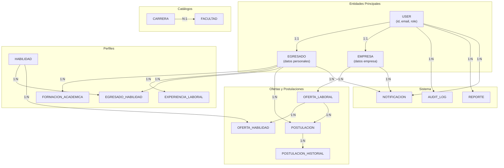
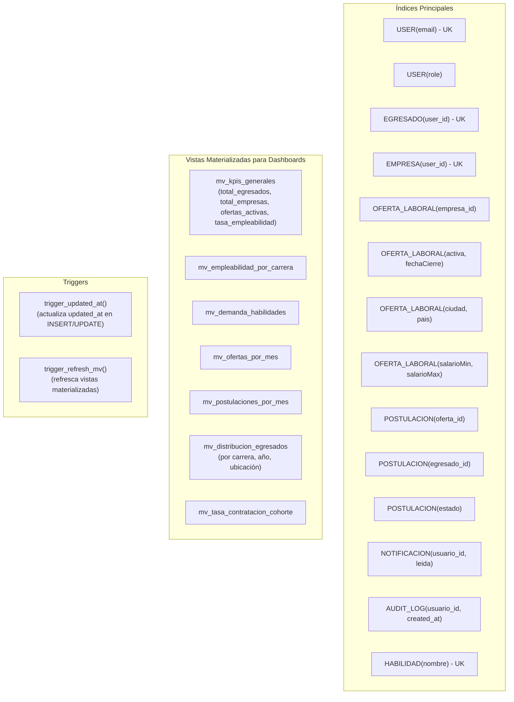

# Modelo de Datos del Sistema de Egresados y Oferta Laboral

## Diagrama Entidad-Relación (ER)

```mermaid
erDiagram
    USER ||--|| EGRESADO : "1:1 extends"
    USER ||--|| EMPRESA : "1:1 extends"
    USER ||--o{ AUDIT_LOG : "creates"

    USER {
        uuid id PK
        string email UK
        string passwordHash
        enum role "ADMIN|EGRESADO|EMPRESA"
        timestamp createdAt
        timestamp updatedAt
        boolean isActive
    }

    EGRESADO ||--|| USER : "1:1"
    EGRESADO ||--o{ EGRESADO_HABILIDAD : "has"
    EGRESADO ||--o{ EXPERIENCIA_LABORAL : "has"
    EGRESADO ||--o{ FORMACION_ACADEMICA : "has"
    EGRESADO ||--o{ POSTULACION : "creates"
    EGRESADO ||--o{ NOTIFICACION : "receives"

    EGRESADO {
        uuid id PK
        uuid userId FK UK
        string nombres
        string apellidos
        string telefono
        date fechaNacimiento
        string fotoUrl
        string cvUrl
        text biografia
        enum genero "M|F|O"
        boolean buscandoEmpleo
        timestamp createdAt
        timestamp updatedAt
    }

    EMPRESA ||--|| USER : "1:1"
    EMPRESA ||--o{ OFERTA_LABORAL : "creates"
    EMPRESA ||--o{ NOTIFICACION : "receives"

    EMPRESA {
        uuid id PK
        uuid userId FK UK
        string nombre
        string nit
        string sector
        string telefono
        string direccion
        string logoUrl
        text descripcion
        string ciudad
        string pais
        boolean verificada
        timestamp createdAt
        timestamp updatedAt
    }

    FORMACION_ACADEMICA {
        uuid id PK
        uuid egresadoId FK
        string institucion
        string titulo
        string carrera
        date fechaInicio
        date fechaFin
        boolean culminada
        timestamp createdAt
        timestamp updatedAt
    }

    EXPERIENCIA_LABORAL {
        uuid id PK
        uuid egresadoId FK
        string empresa
        string cargo
        text descripcion
        date fechaInicio
        date fechaFin
        boolean trabajoActual
        timestamp createdAt
        timestamp updatedAt
    }

    HABILIDAD {
        uuid id PK
        string nombre UK
        enum tipo "TECNICA|BLANDA"
        string categoria
        timestamp createdAt
    }

    EGRESADO_HABILIDAD {
        uuid id PK
        uuid egresadoId FK
        uuid habilidadId FK
        enum nivel "BASICO|INTERMEDIO|AVANZADO|EXPERTO"
        timestamp createdAt
    }

    OFERTA_LABORAL ||--|| EMPRESA : "created by"
    OFERTA_LABORAL ||--o{ OFERTA_HABILIDAD : "requires"
    OFERTA_LABORAL ||--o{ POSTULACION : "receives"

    OFERTA_LABORAL {
        uuid id PK
        uuid empresaId FK
        string titulo
        text descripcion
        text requisitos
        text beneficios
        enum modalidad "PRESENCIAL|REMOTO|HIBRIDO"
        enum tipoContrato "TIEMPO_COMPLETO|PARCIAL|POR_HORA|PROYECTO"
        decimal salarioMin
        decimal salarioMax
        string moneda
        string ciudad
        string pais
        boolean activa
        int plazasDisponibles
        date fechaCierre
        timestamp createdAt
        timestamp updatedAt
    }

    OFERTA_HABILIDAD {
        uuid id PK
        uuid ofertaId FK
        uuid habilidadId FK
        boolean obligatoria
        timestamp createdAt
    }

    POSTULACION {
        uuid id PK
        uuid ofertaId FK
        uuid egresadoId FK
        enum estado "POSTULADO|EN_REVISION|ENTREVISTA|CONTRATADO|RECHAZADO"
        text cartaPresentacion
        timestamp fechaPostulacion
        timestamp updatedAt
    }

    POSTULACION_HISTORIAL {
        uuid id PK
        uuid postulacionId FK
        enum estadoAnterior
        enum estadoNuevo
        string comentario
        uuid cambiadoPor FK
        timestamp createdAt
    }

    NOTIFICACION {
        uuid id PK
        uuid usuarioId FK
        string tipo
        string titulo
        text mensaje
        json datosAdicionales
        boolean leida
        timestamp createdAt
    }

    REPORTE {
        uuid id PK
        uuid usuarioId FK
        string tipo
        json parametros
        string archivoUrl
        enum estado "PENDIENTE|PROCESANDO|COMPLETADO|ERROR"
        timestamp fechaInicio
        timestamp fechaFin
        string errorMensaje
        timestamp createdAt
        timestamp updatedAt
    }

    AUDIT_LOG {
        uuid id PK
        uuid usuarioId FK
        string accion
        string entidad
        uuid entidadId
        json datosAnteriores
        json datosNuevos
        string ipAddress
        timestamp createdAt
    }

    CARRETA {
        uuid id PK
        string nombre
        string codigo
        uuid facultadId FK
        timestamp createdAt
        timestamp updatedAt
    }

    FACULTAD {
        uuid id PK
        string nombre
        string codigo
        timestamp createdAt
        timestamp updatedAt
    }
```

## Diagrama de Relaciones (Detallado)



## Diagrama de Índices y Vistas Materializadas

